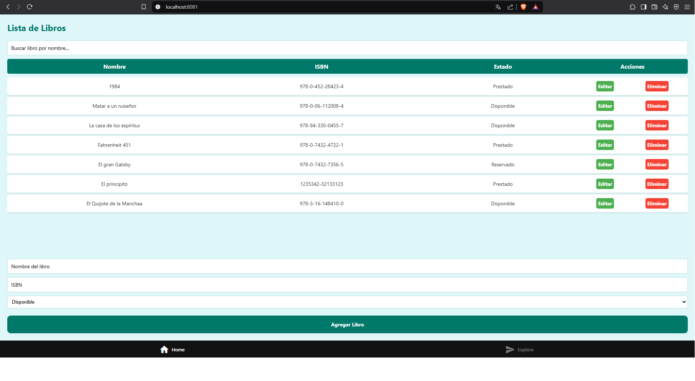

# Biblioteca Pública de México - Proyecto Técnico

## Descripción 📚

La **Biblioteca Pública de México** lleva el registro de los libros que tiene en su poder en papel. Este proyecto tiene como objetivo digitalizar el proceso de registro, visualización, actualización y eliminación de libros dentro de la biblioteca mediante una aplicación web y móvil. 

La directora de la biblioteca busca implementar tecnología para facilitar la gestión de los libros y mejorar la experiencia del usuario.

## Funcionalidades 🚀

1. **Registro de Libros 🆕**
   - Permite registrar nuevos libros con los siguientes datos:
     - Nombre del libro
     - ISBN
     - Estatus del libro (Prestado, perdido, disponible)

2. **Visualización y Búsqueda de Libros 🔍👀**
   - Muestra una lista de libros registrados en la biblioteca.
   - Permite la búsqueda por nombre para encontrar libros rápidamente.
   - Visualización de detalles de un libro específico.

3. **Actualización de Libros ✍️**
   - Permite actualizar la información de un libro ya registrado.
   - Se pueden modificar el nombre, ISBN y el estatus del libro.

4. **Eliminación de Libros 🗑️**
   - Eliminar un libro de la base de datos.


## Tecnologías Utilizadas 🛠️

### Backend
- **Node.js** y **Express** para crear la API RESTful.
- **PostgreSQL** como base de datos relacional.
- **AWS** para alojar la base de datos y la aplicación.
- **dotenv** para la gestión de variables de entorno.
- **Axios** para hacer peticiones HTTP.

### Frontend
- **React Native con Expo** para el desarrollo de la aplicación móvil y web.
- **Axios** para la comunicación con la API del backend.

## Instalación y Ejecución 🏃‍♂️

### Backend

1. Clona el repositorio del backend:
   ```bash
   git clone https://github.com/HelixAsphyxia/Biblioteca
   cd Biblioteca
## Dependencias del Proyecto 📦

### Backend (Node.js)

- **pg**: Paquete para interactuar con bases de datos PostgreSQL.
- **dotenv**: Paquete para cargar variables de entorno desde el archivo `.env`.
- **express**: Framework para crear aplicaciones web y API RESTful.
- **cors**: Middleware para habilitar CORS (Cross-Origin Resource Sharing).
- **axios**: Paquete para realizar solicitudes HTTP.

### Frontend (React Native con Expo)

- **react-native**: Framework para el desarrollo de aplicaciones móviles.
- **expo**: Herramienta para desarrollar aplicaciones móviles utilizando React Native.
- **@react-native-picker/picker**: Componente de selección de lista desplegable para React Native.
- **axios**: Paquete para realizar solicitudes HTTP.
- **react-navigation**: Para la navegación entre pantallas en la aplicación móvil.

## Uso de la Aplicación 🚀

### Backend

Para correr el servidor backend en tu terminal, usa el siguiente comando:

```bash
npm run dev
```

### Frontend

Ejecuta el servidor de desarrollo en la web:
```bash
npm run dev
```npx expo start 
```
Gracias!

